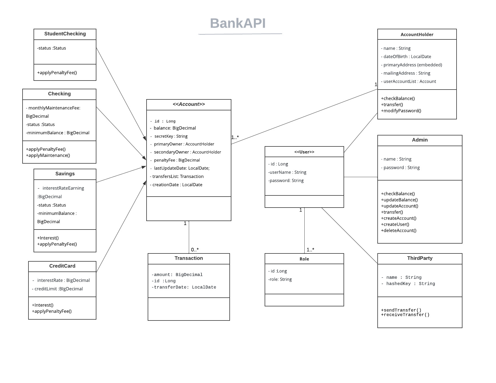
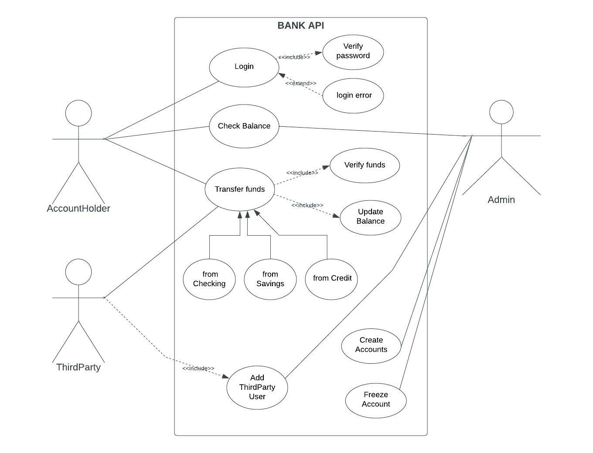

# Bank BackEnd Project

## Table of Contents

1. [General Info](#general-information)
2. [User Requirements](#user-requirements)
3. [How it works](#how-it-works)
4. [End Points](#end-points)
5. [Class Diagram](#class-diagram)
6. [Use Case Diagram](#use-case-diagram)

## General Information:

This project consists of a banking system built with the following Tech Stack :

- Java

- SpringBoot including authentication with Spring Security

- MySQL

## User Requirements:

- Database schema name: `project`
- A default admin user is created ( username: `admin` , password: `admin`).

## How it works:

First, you need to create an Account Holder:

- ***POST :***  `/create-account-holder`  *(Role: "ADMIN")*

```
  {
    "username": String,
    "password": String,
    "dateOfBirth": LocalDate **(format: year-month-day)**,
    "primaryAddress": {
        "address": String,
        "postalCode": int,
        "city": String,
        "country": String
   },
    "mailingAddress": String
   }
```

Second, you can create either a Checking, Savings or CreditCard Account.

If your age is under 24, an Student Account will be created automatically.

Some default values will be instantiated depending on account type. You can update them later.

- ***POST :***  `/create-checking-account` *(Role: "ADMIN")*

- ***POST :*** `/create-savings-account` *(Role: "ADMIN")*

- ***POST :***  `/create-credit-card` *(Role: "ADMIN")*

```
  {
    "secretKey": String,
    "balance": BigDecimal with 2 decimals
    "primaryOwner": {
        "id": Long userId,
        "username": String,
        "password": String,
        "dateOfBirth": LocalDate **(format: year-month-day)**,
        "primaryAddress": {
            "address": String,
            "postalCode": int,
            "city": String,
            "country": String
        },
    "mailingAddress": String
    }
}
``` 
## End Points:

Below, you can find a list of detailed functionalities of the application.

There are three types or role : admins, account holders and third party.

AccountHolders are able to transfer money from any of their accounts to any other account. The transfer only will be processed if it has sufficient funds.

  - ***POST :*** `/transfer` *(Role: "ACCOUNT_HOLDER")*
  
```
  {
     "originAccountId": Long,
     "destinationAccountId": Long,
     "amount": BigDecimal with two decimals,
     "senderName": String
  }
```


 - ***POST :*** `/transfer/send` `*(Role: "THIRD_PARTY")*

```
 {
       "accountId": Long,
       "amount": BigDecimal with two decimals,
 }
```
  - ***POST :*** `/transfer/receive` *(Role: "THIRD_PARTY")*

```
{
       "accountId": Long,
       "secretKey": String,
       "amount": BigDecimal with two decimals,
} 
```
   - ***POST :*** `/create-third-party` *(Role: "ADMIN")*
```
{
       "name": String,
       "hashKey": String,
}
```
  - ***POST :*** `/create-admin` *(Role: "ADMIN")*
```
{
       "username": String,
       "password": String,
}
```

- ***GET :*** `/check-user-balance`  *(Role: "ACCOUNT_HOLDER")*
    @RequestParam `accountId` : Long, @RequestParam `userId` : Long

- ***GET :*** `/check-balance/{id}`  *(Role: "ADMIN")*
  
- ***GET :*** `/accounts`  *(Roles: "ADMIN", "ACCOUNT_HOLDER")*
  
- ***GET :*** `/account/{id}`  *(Roles: "ADMIN", "ACCOUNT_HOLDER")*

- ***PATCH*** `/set-balance/{id}`  *(Role: "ADMIN")*
        @RequestParam  `balance` : BigDecimal

- ***DELETE*** `/delete-account/{id}`  *(Role: "ADMIN")*

- ***PUT*** `/update-checking-account/{id}` *(Role: "ADMIN")*

```
{
    "secretKey": String,
    "balance": BigDecimal with two decimals,
    "primaryOwner": {
        "id": Long **(userId)**,
        "username": String,
        "password": String,
        "dateOfBirth": LocalDate **(format: year-month-day)**,
        "primaryAddress": {
            "address": String,
            "postalCode": int,
            "city": String,
            "country": String
        },
    "mailingAddress": String
    },
    "secondaryOwner": null,
    "creationDate": LocalDate **(format: year-month-day)**,
    "lastUpdateDate": LocalDate **(format: year-month-day)**,
    "status": ENUM **(ACTIVE or FREEZE)**,
    "id": Long **(accountId)**,
    "penalty_FEE": BigDecimal with two decimals
}
```

## Class Diagram



## Use Case Diagram



