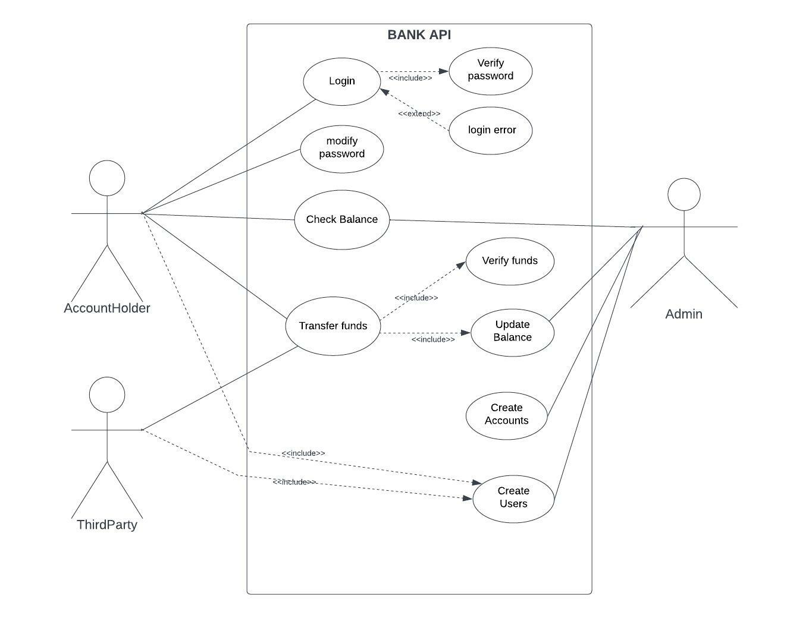

# Bank BackEnd Project

## Table of Contents

1. [General Info](#general-information)
2. [User Requirements](#user-requirements)
3. [End Points](#end-points)
4. [Class Diagram](#class-diagram)
5. [Use Case Diagram](#use-case-diagram)

## General Information:

## User Requirements:

- Database schema: `project`
- ADMIN user:  username: `admin` , password: `admin`

## END POINTS

***POST :***

  - /transfer *(Role: "ACCOUNT_HOLDER")*
  
```
  {
     "originAccountId": Long,
     "destinationAccountId": Long,
     "amount": BigDecimal,
     "senderName": String
  }
```
  - /create-checking-account *(Role: "ADMIN")*

  - /create-savings-account *(Role: "ADMIN")*

  - /create-credit-card *(Role: "ADMIN")*

```
  {
      "secretKey": String,
      "balance": BigDecimal,
      "primaryOwner": AccountHolder 
  } 
```  
   - /transfer/send *(Role: "THIRD_PARTY")*

```
 {
       "accountId": Long,
       "amount": BigDecimal
 }
```
  - /transfer/receive *(Role: "THIRD_PARTY")*

```
{
       "accountId": Long,
       "secretKey": String,
       "amount": BigDecimal
} 
```
  - /create-account-holder *(Role: "ADMIN")*

```
{
       "username": String,
       "password": String,
       "address": PrimaryAddress,
       "dateOfBirth": LocalDate
}
```
  - /create-third-party *(Role: "ADMIN")*
```
{
       "hashKey": String,
       "name": String,
}
```
  - /create-admin *(Role: "ADMIN")*
```
{
       "username": String,
       "password": String,
}
```

***GET :***

  - /check-user-balance *(Role: "ACCOUNT_HOLDER")*
    @RequestParam Long accountId, @RequestParam Long userId

  - /check-balance/{id} *(Role: "ADMIN")*
  
  - /accounts *(Roles: "ADMIN", "ACCOUNT_HOLDER")*
  
  - /account/{id} *(Roles: "ADMIN", "ACCOUNT_HOLDER")*

***PUT***

  - /update-checking-account/{id} *(Role: "ADMIN")*

```
{
    "secretKey": String,
    "lastUpdateDate": LocalDate,
    "primaryOwnerId": Long,
    "creationDate": LocalDate,
    "secondaryOwner": AccountHolder
}
```

***PATCH***

  - /set-balance/{id} *(Role: "ADMIN")*
    @RequestParam BigDecimal balance
***DELETE***

  - /delete-account/{id} *(Role: "ADMIN")*


## Class Diagram


## Use Case Diagram



admin
{

"username": "admin",
"password": "$2a$10$5KdIFstiKYrLqy4b5nQXXeR7rr4YzUSFdiEyBlhy2pkgINwONBtTq"
},

ah
{
"username": "Negu",
"password": "$2a$10$tREU5kf2CBhMATy2/uHmFO3FYKaia/H244gLz99cifHZoWCrSeYLG",
"dateOfBirth": "2002-01-01",
"primaryAddress": {
"address": "c/Lesmes",
"postalCode": 8330,
"city": "Barcelona",
"country": "Spain"
},
"mailingAddress": null
}

tp
{
  "name": "becu",
  "hashKey": "xxx"
   
 }

accounts:
{
"secretKey": "abc",
"balance": 800.00, //con 2 decimales""
"primaryOwner": {
"id":3,
"username": "Negu",
"password": "123",
"dateOfBirth": "2002-01-01",
"primaryAddress": {
"address": "c/Lesmes",
"postalCode": 8330,
"city": "Barcelona",
"country": "Spain"
},
"mailingAddress": null
}}

transfer
{
"originAccountId": 2,
"destinationAccountId": 3,
"amount": 50.00 ,
"senderName": "Negu"
}

update
{
"secretKey": "aaa",
"balance": 500.00,
"primaryOwner": {
"id": 3,
"username": "Negu",
"password": "$2a$10$Blqn0S6ZHzkWiiatMtkcNetw/sBlY3cj.el.WQqBBciyVp0cNYYZa",
"dateOfBirth": "2002-01-01",
"primaryAddress": {
"address": "c/Lesmes",
"postalCode": 8330,
"city": "Barcelona",
"country": "Spain"
},
"mailingAddress": null
},
"secondaryOwner": null,
"creationDate": "2022-12-09",
"lastUpdateDate": "2022-12-09",
"status": null,
"id": 1,
"penalty_FEE": 40.00
}